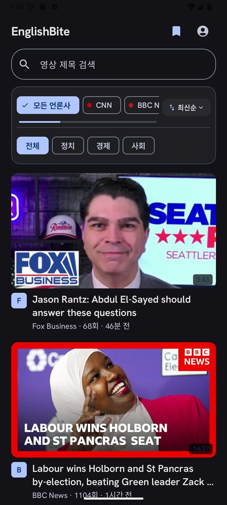
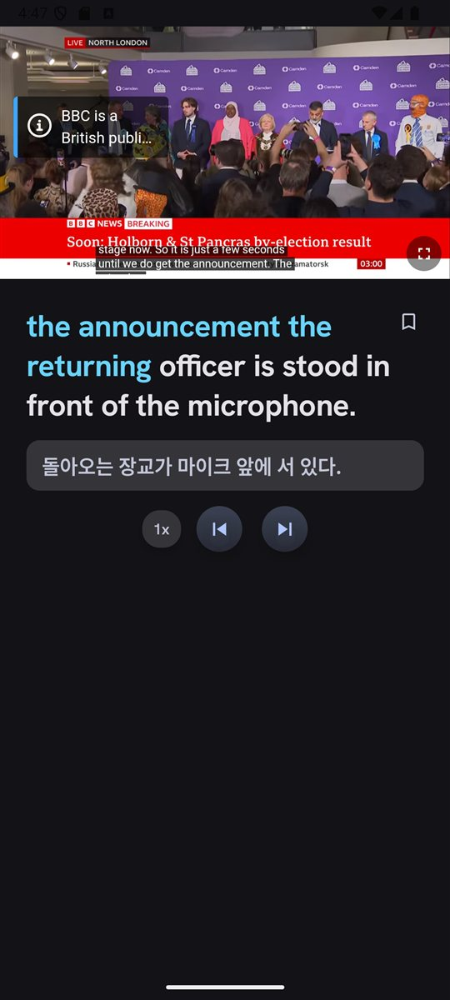
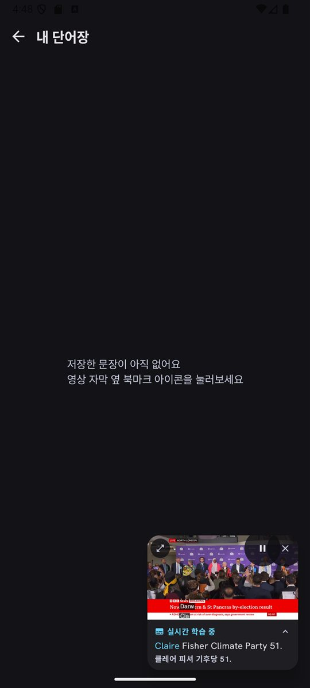
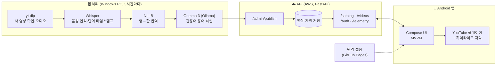

<div align="center">

# EnglishBite

**진짜 뉴스로, 한 입씩.**

실제 해외 뉴스 영상으로 영어를 익히는 직장인용 학습 앱.<br>
CNN, BBC, Bloomberg, The Economist, Fox Business 영상을 문장 단위로 듣고, 따라 읽고, 저장합니다.


<br>

  

</div>

---

## 왜 만들었나

교재 영어와 실제 뉴스 영어 사이에는 큰 간극이 있습니다. 관용어, 정치·경제 용어, 빠른 말투는 교재에 잘 나오지 않습니다.
EnglishBite는 **실제 뉴스 영상**을 교재로 삼고, 한 문장씩 끊어 듣는 데 집중합니다.

학습은 세 단계로 진행합니다.

1. **한국어 자막으로 보기**: 내용부터 이해
2. **영어 자막 + 관용어 해설**: 모르는 표현을 그 자리에서 확인
3. **자막 없이 듣기**: 귀로만 따라가기

## 주요 기능

### 🎧 문장 단위 학습
- **단어별 하이라이트 자막**: 영상의 단어별 타임스탬프에 맞춰, 지금 말하는 단어까지 색이 칠해짐
- **문장 반복과 이동**: 자막 문장을 누르면 그 문장을 다시 재생, 이전/다음 문장 버튼, 재생 속도 조절
- **한국어 번역 자막**: 문장마다 한국어 번역을 함께 표시
- **길게 눌러 사전 검색**: 모르는 단어를 길게 누르면 바로 사전으로

### 📚 저장과 복습
- **단어장**: 문장과 관용어를 북마크해 모아 보기
- **미니 플레이어**: 다른 화면으로 가도 영상과 자막이 작은 창으로 계속 재생

### 📰 영상 목록
- 언론사별(CNN, BBC 등)·분야별(정치, 경제, 사회) 필터, 제목 검색, 최신순 정렬
- 새 영상은 3시간마다 자동으로 추가

## 구조



- **무거운 처리는 PC에서, 서버는 저장과 서빙만**: YouTube가 데이터센터 IP의 다운로드를 차단해서, 영상 수집부터 음성 인식·번역·관용어 추출까지 집 PC가 맡습니다. 서버는 완성된 결과만 받아 저장하므로 작은 인스턴스로 충분합니다.
- **되돌린 설계**: 폰에서 직접 수집하는 방식도 구현했지만, 화면이 꺼지면 백그라운드 작업이 종료되어 무인 정기 작업으로는 신뢰할 수 없어 되돌렸습니다.

## 운영

비공개 테스트 중이라, 테스터 폰에 깔린 구버전까지 고려해 설계했습니다.

| 항목 | 내용 |
|---|---|
| 원격 설정 | `docs/app-config.json`(GitHub Pages)에서 서버 주소와 최소 버전을 읽음. 앱 배포 없이 서버 이전 가능 |
| 강제 업데이트 | 최소 버전보다 낮으면 업데이트 안내 화면 표시 |
| 크래시 리포트 | 비정상 종료를 기기에 저장했다가 다음 실행 때 서버로 전송 |
| 개발·운영 분리 | debug 빌드는 개발 서버, release 빌드는 운영 서버. 변경은 개발 서버에서 먼저 확인 |
| 하위 호환 | 테스트 기간에는 API를 추가만 하고 변경·삭제하지 않음 |
| 계정 | 가입, 로그인, 비밀번호 변경, 탈퇴 (웹 탈퇴 페이지 포함) |

## 기술 스택

| 영역 | 사용 기술 |
|---|---|
| 앱 | Kotlin 2.0, Jetpack Compose (Material 3), MVVM, Coroutines/StateFlow |
| 재생 | YouTube 임베드 플레이어, 단어별 타임스탬프 하이라이트 |
| 처리 파이프라인 | Python, yt-dlp, faster-whisper, NLLB (영→한), Gemma 3 4B (Ollama) |
| 서버 | Python, FastAPI, AWS EC2 |
| 배포 | Google Play 비공개 테스트, GitHub Pages (원격 설정, 개인정보처리방침, 탈퇴 페이지) |

## 프로젝트 구조

```
app/src/main/java/com/mhmh2/englishbite/
├── data/    API, 인증 토큰, 원격 설정, 크래시 리포트
├── ui/      목록, 학습(하이라이트 자막), 로그인, 스플래시, 업데이트 안내
└── vocab/   단어장

backend/
├── translate/
│   ├── admin_sync.py   PC에서 실행: 새 영상 수집 → 처리 → 서버로 게시
│   ├── pipeline.py     Whisper 음성 인식, NLLB 번역
│   ├── idioms.py       Gemma 3 관용어 추출
│   ├── catalog.py      채널별 영상 목록
│   └── server.py       FastAPI 서버
└── deploy/             서버 배포 스크립트와 운영 문서 (dev / prod)

docs/                   GitHub Pages: 원격 설정, 개인정보처리방침, 계정 삭제
```

## 빌드

```bash
./gradlew assembleDebug
```

- debug 빌드는 개발 서버, release 빌드는 원격 설정이 가리키는 운영 서버에 연결합니다.
- release 서명 정보는 `keystore.properties`에 두며 저장소에는 없습니다 (`keystore.properties.example` 참고).
- 서버 배포 절차는 [`backend/deploy/README.md`](backend/deploy/README.md)에 있습니다.

---

<div align="center">
<sub>Real news, one bite at a time. · 진짜 뉴스로, 한 입씩.</sub>
</div>
